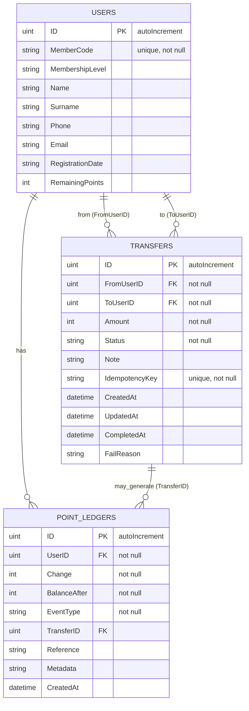

# Database ER Diagram

This file contains an Entity-Relationship diagram (Mermaid format) representing the database tables and relationships inferred
from the backend code in `internal/models`.

## How this map was created

The diagram was generated by inspecting `internal/models/models.go`. The repository uses GORM (SQLite driver) and AutoMigrate to create these tables at runtime (see `internal/store/store.go`).

If you want a PNG/SVG export, render this Mermaid block using any Mermaid renderer (VS Code Mermaid Preview, mermaid.cli, or Mermaid Live Editor).
